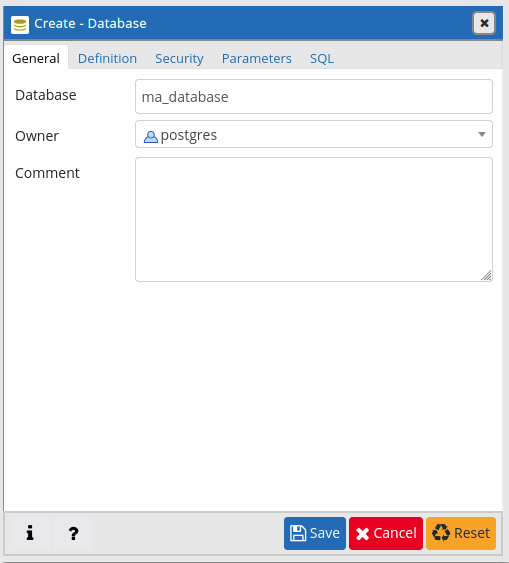

# jakarta-rest-api requirements

Jakarta EE 8 rest api

Need java11 and payara5

Build the project with maven

# PostgreSQL database docker setup

## Pull postgres image:

`docker pull postgres`

## Run postgres :

`docker run --name postgres -e POSTGRES_USER=postgres -e POSTGRES_PASSWORD=1234 -p 5432:5432 -d postgres`

## Pull pgadmin :

`docker pull dpage/pgadmin4`

## Run pgadmin4 :

`docker run --name pgadmin -d -p 5050:5050 thajeztah/pgadmin4`

# SQL script:

First create a postgreSQL database on pgadmin 4 :



Then execute the following script :

```sql
CREATE TABLE personne (
    id int NOT NULL,
    name varchar(50),
    age int,
    CONSTRAINT personne_pkey PRIMAEY KEY (id)
);

INSERT INTO personne VALUES (1, 'Nicolas', 25);
SELECT * FROM personne
```
